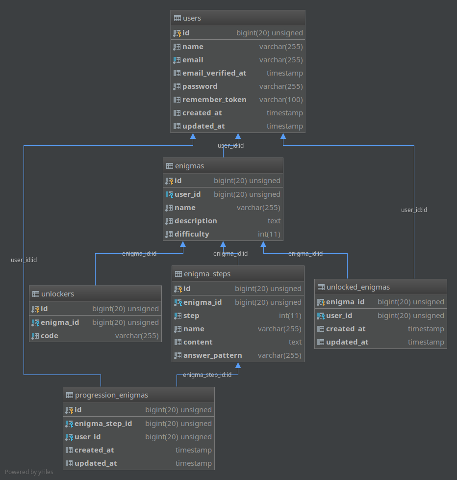

# BDE-Enigma-Web

This website is using the [Laravel Framework 5.8](https://laravel.com/), [TailwindCSS](https://tailwindcss.com/) and more.

Some challenges were generated with tools available [here](https://github.com/JesusCrie/BDE-Enigma).

## Setup

### Requirements

- Node.JS + npm
- PHP >= 7.1
- Composer
- MySQL/MariaDB or similar

The setup script will do most of the installation work.
```
npm run setup
```

### Database
> Don't forget to start MySQL/MariaDB

Edit the `.env` file and add your credentials in it.
```.env
DB_CONNECTION=mysql
DB_HOST=localhost
DB_PORT=3307
DB_DATABASE=bde_laravel
DB_USERNAME=root
DB_PASSWORD=password
```

Then create and populate the database.
```
npm run db-reset
```

After creating an account, you can run the seeders that requires a user.
```
npm run db-postreset
```

## Running the app

Before running the app, you need to let webpack process the assets.
```
npm run dev
# or
npm run prod
```

> Alternatively, one can use `npm run watch` to let webpack rebuild 
> your assets automatically on changes

You can now ship it to your web server or use the embedded development server.
```
php artisan serve
```

## Structure

### Database

The database looks like this.


### Enigmas

Each `Enigma` has an owner, a difficulty, a name and description and is
composed of one or more `EnigmaPart`s.

Each `EnigmaPart` is composed of a name, an indicator for which step it is,
a regex that will be matched again the user-supplied string while
attempting to validate this step.

In addition of that, `EnigmaPart`s provides a content/description that can
be a simple string that will be rendered or you can specify any blade
component by prefixing your string with `!!` (eg. `!!components.parts.demo_part`).

Enigmas are hardcoded in the database, to add one, simply add its
corresponding entry in the database via the dedicated seeder
(`database/seeds/EnigmaTableSeeder.php` for `Enigma`s and
`database/seeds/EnigmaStepTableSeeder.php` for `EnigmaStep`s)

By default, enigmas are locked, only those listed under the `unlocked_enigmas`
table can be accessed. You can manually unlock them in the appropriate seeder
or add a key than can be used by a user to unlock it. You can register
such key in the appropriate seeder.
